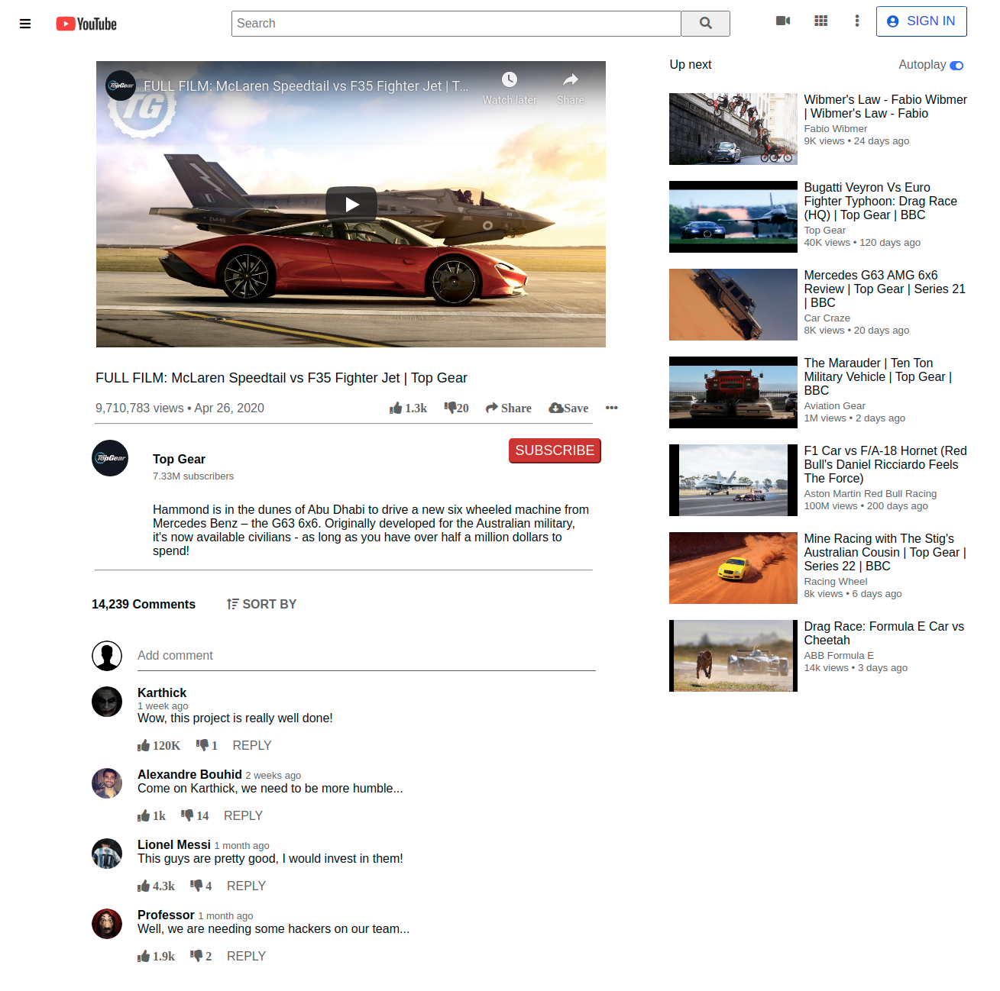

# Youtube Project

> This is the first project of the Microverse Program, which focus on applying CSS and Html knowledge to recreate a Youtube webpage.

Additional description about the project and its features:

## Built With

- Html and CSS.

## Live Demo

[live demo link](https://abouhid.github.io/youtube_project/)

## Authors

👤 **Alexandre Bouhid**

- Github: (https://github.com/abouhid)
- Linkedin: (https://www.linkedin.com/in/alexandrebouhid/)

👤 **Karthick Moorthy**

- Github: (https://github.com/karthykarthick)
- Linkedin: (https://www.linkedin.com/in/karthick-harimoorthy/)

## 🤝 Contributing

Contributions, issues and feature requests are welcome!

## Show your support

Give a ⭐️ if you like this project!
